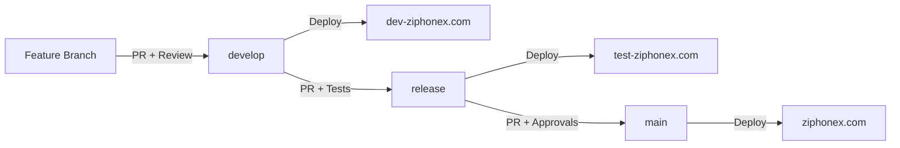

# 🚀 Ziphonex - Transformación Digital Innovadora

<div align="center">


**Revolucionando la presencia digital con innovación tecnológica y estrategia**

[](https://ziphonex.com)
[](https://nextjs.org/)
[](https://www.typescriptlang.org/)
[](https://pnpm.io/)

[🌐 Sitio Web](https://ziphonex.com) • [📧 Contacto](mailto:info@ziphonex.com) • [📱 Servicios](#servicios)

</div>

---

## 📋 Tabla de Contenidos

- [Sobre Ziphonex](#-sobre-ziphonex)
- [Servicios](#-servicios)
- [Stack Tecnológico](#-stack-tecnológico)
- [Estructura del Proyecto](#-estructura-del-proyecto)
- [Ambientes de Desarrollo](#-ambientes-de-desarrollo)
- [Instalación](#-instalación)
- [Scripts Disponibles](#-scripts-disponibles)
- [Workflow de Desarrollo](#-workflow-de-desarrollo)
- [Deployment](#-deployment)
- [Contribuir](#-contribuir)
- [Licencia](#-licencia)

---

## 🎯 Sobre Ziphonex

Ziphonex es una agencia de transformación digital que combina **innovación tecnológica** con **estrategia digital** para impulsar negocios hacia el futuro. Nos especializamos en crear soluciones digitales integrales que generan resultados medibles y transforman la presencia online de nuestros clientes.

### 🌟 Nuestra Propuesta de Valor

- ✨ **Innovación Constante**: Utilizamos las últimas tecnologías y mejores prácticas
- 🎯 **Resultados Medibles**: Enfoque basado en datos y métricas concretas
- 🚀 **Metodología Ágil**: Desarrollo iterativo con entregas continuas
- 💼 **Experiencia Comprobada**: Casos de éxito con incrementos de hasta 300% en conversiones

---

## 🛠️ Servicios

### 💻 Desarrollo Web

- Diseño Responsivo
- SEO Optimizado
- Carga Ultrarápida
- Progressive Web Apps (PWA)

### 🛒 E-Commerce

- Pasarelas de Pago Seguras
- Gestión de Inventario
- Analytics Avanzado
- Integraciones con Marketplaces

### 📱 Aplicaciones Móviles

- UI/UX Intuitivo
- Push Notifications
- Offline Support
- Cross-platform Development

### 📊 Marketing Digital

- SEO/SEM (Keyword Research, Google Ads)
- Social Media Management
- Email Marketing
- Content Strategy

### ☁️ Consultoría Cloud

- Auditoría Digital
- Migración Cloud
- Seguridad Web
- Optimización de Performance

---

## 🏗️ Stack Tecnológico

Este proyecto está construido con tecnologías modernas y escalables:

### Frontend

- **Framework**: [Next.js 15](https://nextjs.org/) (App Router)
- **Language**: [TypeScript 5.x](https://www.typescriptlang.org/)
- **Styling**: [Tailwind CSS](https://tailwindcss.com/)
- **UI Components**: [shadcn/ui](https://ui.shadcn.com/)
- **Icons**: [Lucide React](https://lucide.dev/)
- **Animations**: Framer Motion

### Backend & APIs

- **API Routes**: Next.js API Routes
- **Database**: (Specify your database)
- **ORM**: (Specify if using Prisma, Drizzle, etc.)

### DevOps & Tools

- **Package Manager**: [pnpm](https://pnpm.io/)
- **Deployment**: [Vercel](https://vercel.com/)
- **CI/CD**: GitHub Actions
- **Version Control**: Git & GitHub
- **Code Quality**: ESLint, Prettier
- **Type Checking**: TypeScript

### Testing

- **Unit Tests**: (Specify: Jest, Vitest, etc.)
- **E2E Tests**: (Specify: Playwright, Cypress, etc.)

---

## 📁 Estructura del Proyecto

```
web-ziphonex/
├── .github/
│   ├── workflows/
│   │   └── deploy.yml          # GitHub Actions CI/CD
│   ├── CODEOWNERS              # Code ownership rules
│   └── pull_request_template.md
├── app/
│   ├── api/                    # API Routes
│   ├── (routes)/               # Application routes
│   │   ├── layout.tsx
│   │   └── page.tsx
│   ├── layout.tsx              # Root layout
│   ├── page.tsx                # Home page
│   └── globals.css             # Global styles
├── components/
│   ├── ui/                     # shadcn/ui components
│   └── ...                     # Custom components
├── lib/
│   ├── utils.ts                # Utility functions
│   └── ...                     # Helper functions
├── public/
│   ├── images/                 # Static images
│   └── ...                     # Static assets
├── .env.local                  # Local environment variables
├── .env.development            # Development environment
├── .env.test                   # Test environment
├── .env.production             # Production environment
├── .npmrc                      # pnpm configuration
├── next.config.js              # Next.js configuration
├── tailwind.config.ts          # Tailwind CSS configuration
├── tsconfig.json               # TypeScript configuration
├── vercel.json                 # Vercel deployment config
└── package.json                # Dependencies and scripts
```

---

## 🌍 Ambientes de Desarrollo

Este proyecto utiliza una estrategia de múltiples ambientes para garantizar calidad:

| Ambiente         | Branch    | URL                                            | Propósito                     |
| ---------------- | --------- | ---------------------------------------------- | ----------------------------- |
| **Development**  | `develop` | [dev-ziphonex.com](https://dev-ziphonex.com)   | Desarrollo y pruebas internas |
| **Test/Staging** | `release` | [test-ziphonex.com](https://test-ziphonex.com) | Pruebas antes de producción   |
| **Production**   | `main`    | [ziphonex.com](https://ziphonex.com)           | Ambiente en vivo              |

### 🔄 Flujo de Trabajo Git



---

## 🚀 Instalación

### Prerrequisitos

- Node.js 18.x o superior
- pnpm 8.x o superior

### Pasos de Instalación

1. **Clonar el repositorio**

```bash
git clone https://github.com/zifherx/web-ziphonex.git
cd web-ziphonex
```

2. **Instalar dependencias**

```bash
pnpm install
```

3. **Configurar variables de entorno**

```bash
cp .env.example .env.local
# Edita .env.local con tus variables
```

4. **Ejecutar en desarrollo**

```bash
pnpm dev
```

5. **Abrir en el navegador**

```
http://localhost:3000
```

---

## 📜 Scripts Disponibles

```bash
# Desarrollo
pnpm dev              # Inicia el servidor de desarrollo
pnpm dev:turbo        # Desarrollo con Turbopack

# Build
pnpm build            # Crea el build de producción
pnpm start            # Inicia el servidor de producción

# Calidad de Código
pnpm lint             # Ejecuta ESLint
pnpm lint:fix         # Corrige problemas de linting
pnpm type-check       # Verifica tipos de TypeScript

# Testing
pnpm test             # Ejecuta los tests
pnpm test:watch       # Tests en modo watch
pnpm test:coverage    # Tests con cobertura

# Otros
pnpm format           # Formatea el código con Prettier
pnpm clean            # Limpia archivos de build
```

---

## 🔄 Workflow de Desarrollo

### 1. Crear una Feature Branch

```bash
git checkout develop
git pull origin develop
git checkout -b feature/nueva-funcionalidad
```

### 2. Desarrollar y Commitear

```bash
# Hacer cambios...
git add .
git commit -m "feat: descripción de la funcionalidad"
```

### 3. Push y Pull Request

```bash
git push origin feature/nueva-funcionalidad
# Crear PR en GitHub hacia develop
```

### 4. Code Review

- Al menos 1 aprobación requerida
- Todos los checks de CI/CD deben pasar
- Resolución de comentarios obligatoria

### 5. Merge a Develop

- Se despliega automáticamente a dev-ziphonex.com
- Pruebas internas y validación

### 6. Release a Test

```bash
# PR de develop → release
# Deploy automático a test-ziphonex.com
```

### 7. Deploy a Production

```bash
# PR de release → main (requiere 2 aprobaciones)
# Deploy automático a ziphonex.com
```

---

## 🚢 Deployment

### Deployment Automático

Este proyecto usa **Vercel** con deployment automático configurado:

- ✅ **Push a develop** → Deploy a dev-ziphonex.com
- ✅ **Push a release** → Deploy a test-ziphonex.com
- ✅ **Push a main** → Deploy a ziphonex.com

### Deployment Manual

```bash
# Usando Vercel CLI
vercel --prod

# O especificando el ambiente
vercel --scope=ziphonex --prod
```

### Variables de Entorno

Las variables de entorno se configuran en:

1. **Vercel Dashboard** → Settings → Environment Variables
2. Archivos `.env.*` para desarrollo local

---

## 🤝 Contribuir

¡Las contribuciones son bienvenidas! Por favor sigue estos pasos:

1. **Fork** el proyecto
2. Crea tu **Feature Branch** (`git checkout -b feature/AmazingFeature`)
3. **Commit** tus cambios (`git commit -m 'feat: Add some AmazingFeature'`)
4. **Push** a la Branch (`git push origin feature/AmazingFeature`)
5. Abre un **Pull Request**

### Convención de Commits

Usamos [Conventional Commits](https://www.conventionalcommits.org/):

- `feat:` Nueva funcionalidad
- `fix:` Corrección de bug
- `docs:` Cambios en documentación
- `style:` Cambios de formato
- `refactor:` Refactorización de código
- `test:` Añadir o modificar tests
- `chore:` Tareas de mantenimiento

---

## 📄 Licencia

Copyright © 2025 Ziphonex. Todos los derechos reservados.

Este proyecto es propiedad de Ziphonex y está protegido por las leyes de propiedad intelectual.

---

## 📞 Contacto

- **Website**: [ziphonex.com](https://ziphonex.com)
- **Email**: info@ziphonex.com
- **GitHub**: [@zifherx](https://github.com/zifherx)

---

<div align="center">

**Hecho con ❤️ por el equipo de Ziphonex**

⭐ Si te gusta este proyecto, considera darle una estrella

</div>
